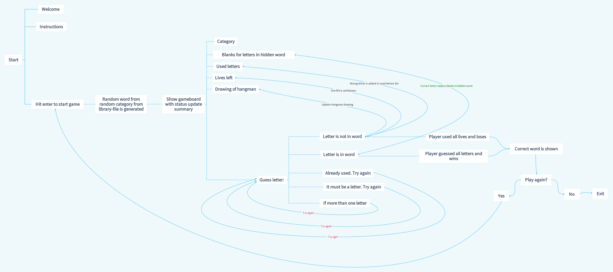

**April 2024**

# Hang in there...
Hang in there is a traditional Hangman and Python terminal game which runs in Code Institute mock terminal on Heroku

## How to play

Play against the computer. A random word from a random category is generated and hidden. See if you can guess the hidden word before you run out of lives and get hung...

* The objective of the game is to guess the hidden word.
* As a hint the category of the word is displayed
* You have 6 lives. Each incorrect guess will cost you a life.
* Try to guess the word before you run out of lives!

## Features
### Existing Feautures

* Random word generator
* Play against computer
* Accept user input
* Maintains guessed letters
* Maintains correct and wrong guesses
* Input validation
    * You must enter a letter
    * You can not enter same letter twice
    * You can only enter one letter at a time
    
### Future Feautures
* Allow player to select the cathegory
* Allow player to add words to the library

## Flowchart

## Data Model

This workflow follows the standard hangman game logic, where the player attempts to guess the hidden word by guessing one letter at a time. The game continues until the player either correctly guesses the word or runs out of lives.

1. **Display Instructions**:
   - The `display_instructions()` function is called at the beginning of the `main()` function.
   - This function clears the terminal, displays the welcome message and instructions for the game, and waits for the user to press Enter to start the game.

2. **Start a New Game**:
   - The `main()` function is called, which starts a new game.
   - It calls the `random_word()` function to select a random category and word.
   - It generates the blanks for the word using the `generate_blanks()` function.
   - It initializes the game state with 6 lives and an empty list of used letters.
   - It calls the `display_status()` function to display the current state of the game.

3. **Gameplay Loop**:
   - The `gameplay()` function is called, which starts the main gameplay loop.
   - Inside the loop, the `display_status()` function is called to update the game display.
   - The `get_guess()` function is called to prompt the user for a guess and validate the input.
   - If the user guesses the "SOLVED" word, the game is won, and the loop is broken.
   - If the user's guess is in the word, the `reveal_letters()` function is called to update the blanks.
   - If the user's guess is not in the word, the number of lives is decremented, and the guess is added to the list of used letters.
   - If the user has guessed all the letters in the word, the game is won, and the loop is broken.
   - If the user runs out of lives, the game is lost, and the loop is broken.

4. **Game Over**:
   - After the gameplay loop is broken, the `display_status()` function is called one last time to display the final game state.
   - Depending on the outcome (win or lose), a message is printed and displayed
   - The `play_again()` function is called, which prompts the user to play again or quit the game.

## Testing
**Manually tested:**
* Code validated through PEP8 linter without issues
* Tested in my gitpod terminal
* Tested in my (Code Institute) Heroku terminal

**Validator Testing:**
* PEP8

### Bugs
**Solved bugs**
* Split up functions
* Organise and chain functions
* Passing parameters where necessary

**Remaining bugs**
* You should not be able to enter the same letter twice. The validation of not entering the same letter twice is not working correctly. Although even if you use a wrong letter several times, you will only lose one life. Therefore, the outcome of the game is not affected by this bug.

## Deployment
The steps for deployment

* Create a new Heroku app
* Add two buildpacks from the _Settings_ tab. The ordering is as follows:
1. `heroku/python`Creating the Heroku app
2. `heroku/nodejs`
* Create a _Config Var_ called `PORT`. Set this to `8000`
* Link the Heroku app to my Github repository
* Click on **Deploy**

## Credit
* Tokyo Ed-tech https://youtu.be/z9YGr0eRfeQ?si=6iU2-78ies0um_DI
* Adding categories to word bank https://youtu.be/fqstJoazHCQ?si=T1ebkd0VLmCChvoA
* Code Institute LMS
* 

-----
Happy gaming!