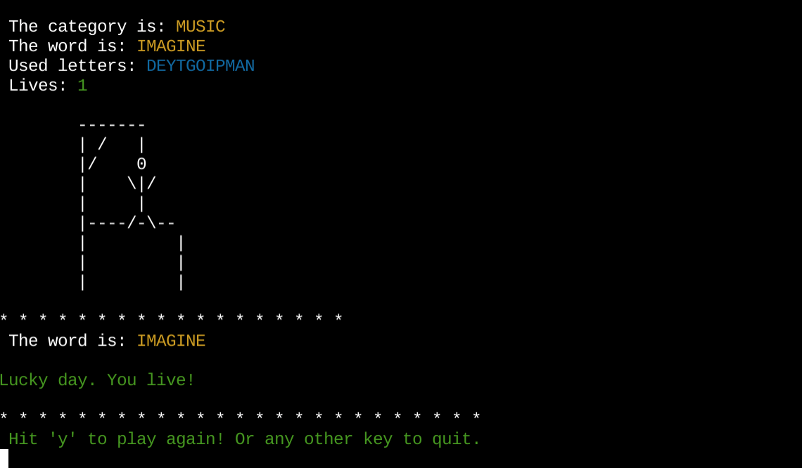
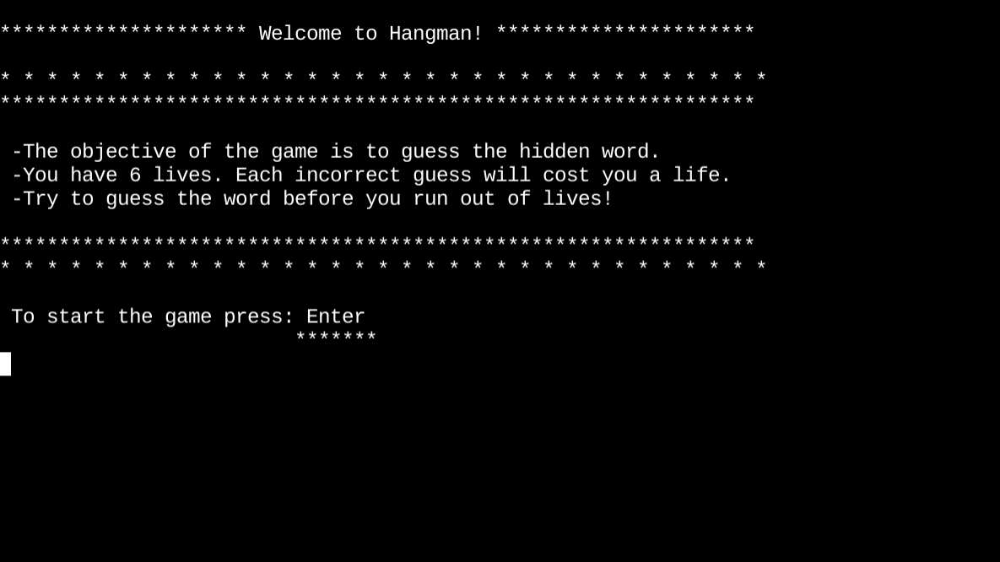
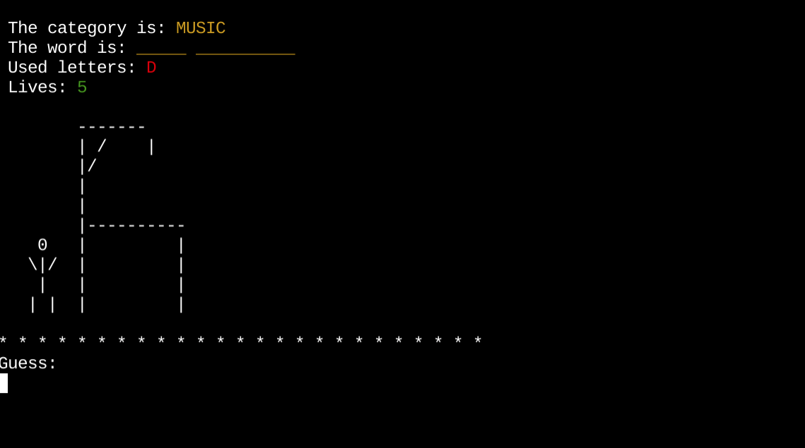
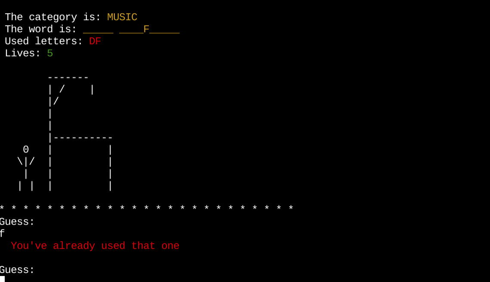
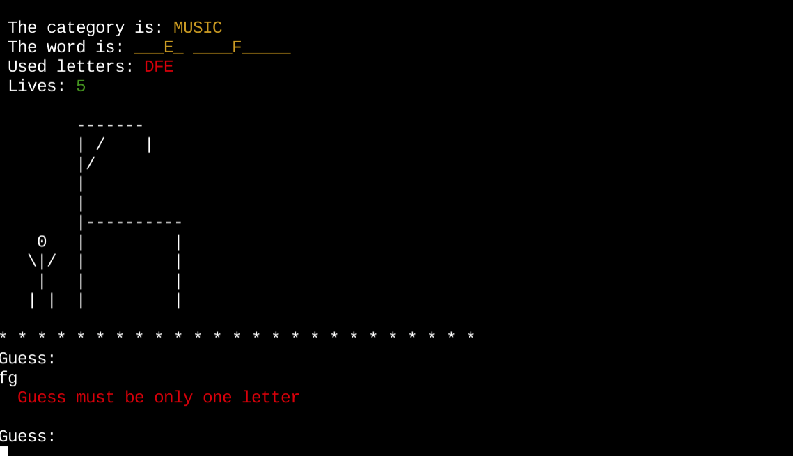
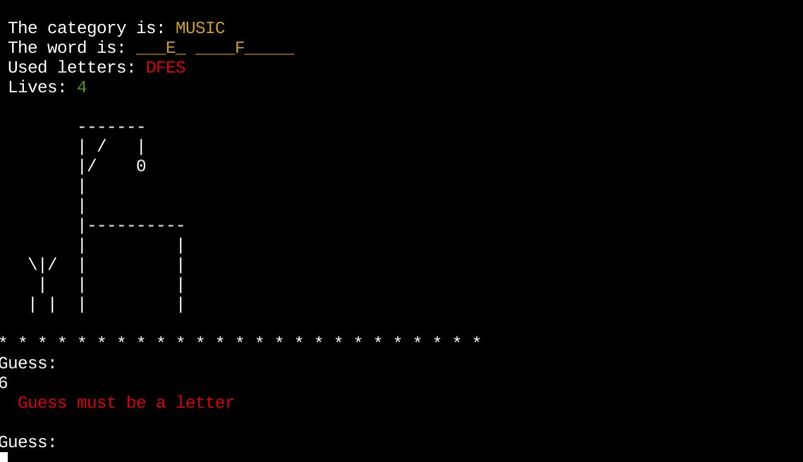
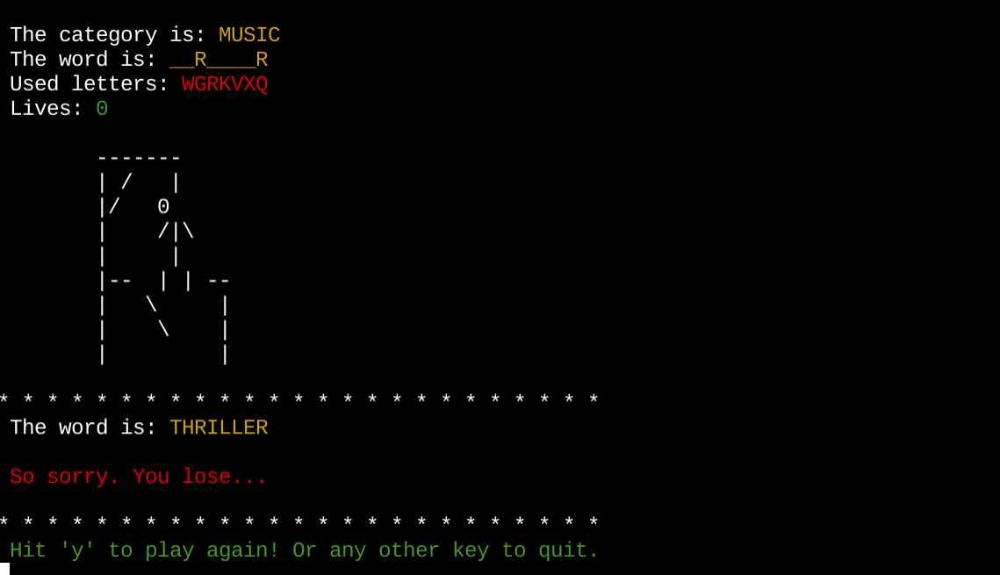
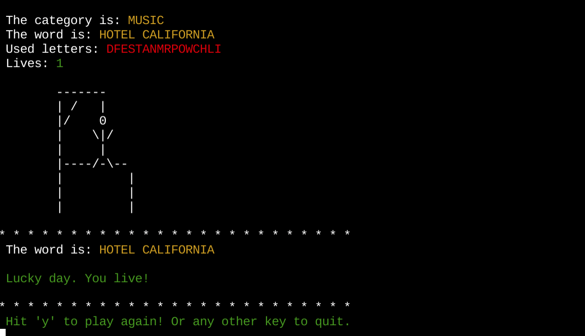

**April 2024**

# Hang in there...
Hang in there is a traditional Hangman and Python terminal game which runs in Code Institute mock terminal on Heroku

## How to play

Play against the computer. A random word from a random category is generated and hidden. See if you can guess the hidden word before you run out of lives and get hung...

* The objective of the game is to guess the hidden word.
* As a hint the category of the word is displayed
* You have 6 lives. Each incorrect guess will cost you a life.
* Try to guess the word before you run out of lives!

## Features

- Random word selection from a random categoty selection from predefined lists of categories
- Keeps track of used letters and remaining lives
- Displays the current state of the game, including the category, the word (with blanks), the used letters, and the remaining lives
- Provides clear instructions and feedback
- Provides the ability to play again

### Welcome view
This is the first view. It contains instructions how to play the game. Player hits enter to start the game. The word 'enter' is underlined to clearly show the call to action.

### The gameboard view
The game status summry is shown at the top and contains
   * The category for the hidden word is shown as a hint for the player. The category is written in yellow 
   * The hidden words letters are replaced with yellow blanks
   * A list of the used letters are shown in red to remind the user which letters they have already used to avoid guessing the same letter again
   * The number of remaing lives are shown with the number i green
   * At the beginning of the game the man is placed to the left waiting for his destiny. Moving one bodypart at a time for every wrong letter.

### Used letter
Guessed letters are listed in red so that the user can see which letters they have already tried.
If guess is incorrect, you lose one life
If guess is correct, it replaces the yellow blank with a yellow letter

### You already used that letter
Error message in red to pay attention to already used letter. 

### It must be only 'one' letter
The warning message is printed in red to pay attention

### It must be a 'letter'
The warning message is printed in red to pay attention

### You lose...
You lose is printed in red as if you are dead.

### You live!
You live is printed in green as if you are free to go.

### Play again or quit
Player can chose to play again by pressing 'y' or any other letter to end the game. The message is printed in green as the preffered action. 

### Future Feautures
* Allow player to select the cathegory
* Allow player to add words to the library

## Flowchart

This workflow follows the standard hangman game logic, where the player attempts to guess the hidden word by guessing one letter at a time. The game continues until the player either correctly guesses the word or runs out of lives.

## Code functionality

1. The code starts by importing the necessary modules: `random` for generating random words, `os` for clearing the screen, `categories` and `men` from custom modules, and `colorama` for adding color to the output.

2. The `display_instructions()` function prints the instructions and rules of the game, waiting for the user to press Enter to start.

3. The `random_word()` function selects a random word and its category from the `categories` dictionary.

4. The `generate_blanks()` function creates a string of underscores and non-alphabetic characters based on the length of the word.

5. The `get_guess()` function prompts the user to guess a letter and validates the input, ensuring it's a single alphabetic character and has not been used before.

6. The `reveal_letters()` function updates the blanks in the word with the correctly guessed letters.

7. The `draw_guy()` function prints the hangman diagram based on the number of remaining lives.

8. The `display_status()` function clears the screen and displays the current game status, including the category, the word (with blanks), the used letters, and the remaining lives.

9. The `gameplay()` function is the main game loop. It generates a random word and category, initializes the game state, and then enters a loop where the user guesses letters. The function updates the game state, displays the status, and checks for a win or loss condition.

10. The `play_again()` function prompts the user to play again or quit the game.

11. The `main()` function calls the `display_instructions()`, `gameplay()`, and `play_again()` functions to run the game.

## Testing
**Manually tested:**
* Code validated through PEP8 linter without issues
* Tested in my gitpod terminal
* Tested in my (Code Institute) Heroku terminal

**Validator Testing:**
* PEP8

### Bugs & Fixes
**Solved bugs**
* Split up functions
* Organise and chain functions
* Passing parameters where necessary

**Fixes**
* Add colorama
* Give a general feedback message for guessing the same letter that has already been releived in the hidden word

**Remaining issues**
* Clear issue in Heroku terminal. A valid enter (a letter that has not been used before) after an invalid enter (= more than one letter, a letter that has been used before, or a character that is not a letter, e.g. a number). 

The issue does not affect the usability since the extra The repetative lines don't affect the usability since they appear outside the terminal window. To see them you have to scroll to the top which would not be the common instinct/behaviour since the visible view covers the gameboard and everything the player needs.
An invalid guess is:

a letter that has been used before,
a double letter,
a number or other character which is not a letter

The issue does not appear in the gitpod terminal. It only shows up when it's deployed to Heroku. And it's only visible if you scroll to the top of the window. Otherwise it will not be noticed, since the rows are added "outside" the vie w.

* CI Python Linter shows: W291 trailing whitespace in men.py file. Left it with purpose since I want some space in the left margin.
* CI Python Linter shows:
   * 65: E501 line too long (91 > 79 characters)
   * 104: E501 line too long (87 > 79 characters)
   * 119: E501 line too long (98 > 79 characters)

## Deployment
The steps for deployment

* Create a new Heroku app
* Add two buildpacks from the _Settings_ tab. The ordering is as follows:
1. `heroku/python`Creating the Heroku app
2. `heroku/nodejs`
* Create a _Config Var_ called `PORT`. Set this to `8000`
* Link the Heroku app to my Github repository
* Click on **Deploy**

## Credit
* Tokyo Ed-tech https://youtu.be/z9YGr0eRfeQ?si=6iU2-78ies0um_DI
* Adding categories to word bank https://youtu.be/fqstJoazHCQ?si=T1ebkd0VLmCChvoA
* Adding colorama to add colors https://www.youtube.com/watch?v=Yq5tL6be0Yk 
* Code Institute LMS
* w3schools https://www.w3schools.com/python/

-----
Hang in there! Good luck!