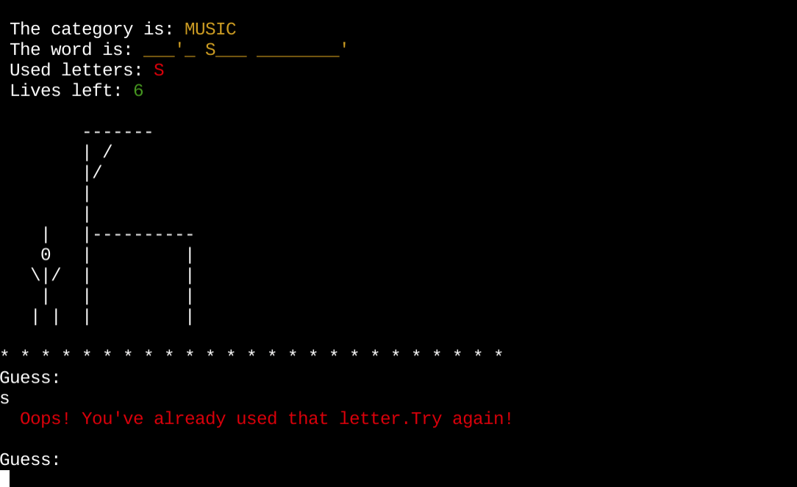

**May 2024**

# Hang in There...
Hang in There is a traditional Hangman and Python terminal game which runs in the Code Institute mock terminal on Heroku. 

Link to the live version of this game https://hangin-25c7e5ea0690.herokuapp.com/

## How to Play

Play against the computer. A random word from a random category is generated and hidden. See if you can guess the hidden word before you run out of lives and get hung...

* The objective of the game is to guess the hidden word.
* As a hint, the category of the word is displayed.
* You have 6 lives. Each incorrect guess will cost you a life.
* Try to guess the letters in the hidden word before you run out of lives!

## Features

### Welcome View
This is the first view. It contains instructions on how to play the game. The player hits Enter to start the game. The word 'Enter' is underlined to draw attention to start the game.

### The Gameboard View
The game status summary is shown and updated after each turn:
   * The category for the hidden word is shown as a hint for the player
   * The category is written in yellow.
   * The hidden word's letters are replaced with yellow blanks.
   * A list of the used letters printed in red to clearly show which letters that have already been used and can't be guessed again
   * The number of remaining lives are shown in green.
   * The man is placed to the left, waiting for his destiny. One body part and one life is lost when player guesses a wrong letter

### Oops! You've already used that letter. Try again!

Error message in red to draw the player's attention.

### Please enter only one letter

The warning message is printed in red to convey the importance of the message.

### Oops! That's not a letter. Please enter a valid letter
The warning message is printed in red to alert the player.

### GAME OVER
So sorry! You lose... is printed in red to emphasize the loss.

### You Live!
"You live" is printed in green, to emphasizes you are free to go.

### Play Again or Quit
The player can choose to play again by pressing 'y' or any other letter to end the game. The message is printed in green as the preferred action.

### Welcome Back
A welcome back message is displayed when the player decides to quit the game, providing a friendly ending experience.

### Future Features
* Allow the player to select a category
* Allow the player to add words to the library

## Flowchart

This workflow follows the standard hangman game logic, where the player attempts to guess the hidden word by guessing one letter at a time. The game continues until the player either correctly guesses the word or runs out of lives.

## Code Functionality

1. The code starts by importing the necessary modules: `random` for generating random words, `os` for clearing the screen, `categories` and `men` from custom modules, and `colorama` for adding color to the output.

2. The `display_instructions()` function prints the instructions and rules of the game, waiting for the user to press Enter to start.

3. The `random_word()` function selects a random word and its category from the `categories` dictionary.

4. The `generate_blanks()` function creates a string of underscores and non-alphabetic characters based on the length of the word.

5. The `get_guess()` function prompts the user to guess a letter and validates the input, ensuring it's a single alphabetic character and has not been used before.

6. The `reveal_letters()` function updates the blanks in the word with the correctly guessed letters.

7. The `draw_guy()` function prints the hangman diagram based on the number of remaining lives.

8. The `display_status()` function clears the screen and displays the current game status, including the category, the word (with blanks), the used letters, and the remaining lives.

9. The `gameplay()` function is the main game loop. It generates a random word and category, initializes the game state, and then enters a loop where the user guesses letters. The function updates the game state, displays the status, and checks for a win or loss condition.

10. The `play_again()` function prompts the user to play again or quit the game.

11. The `main()` function calls the `display_instructions()`, `gameplay()`, and `play_again()` functions to run the game.

## Testing

**Manually Tested:**
* Code validated through PEP8 linter without issues
* Tested in my Gitpod terminal
* Tested in my (Code Institute) Heroku terminal

**Feedback messages work without issues**

### Bugs & Fixes

**Fixes**
* Split up functionsninto smaller, more manageable functions to improve readability and maintainability.
* Organized and chained functions. Grouping related functions together and connecting them in a sequential manner to enhance code organization.
* Passed parameters where necessary to improve flexibility, reduce complexity, and enhance testability.
* Added Colorama
* Add a general feedback message for guessing the same letter that has already been revealed in the hidden word
* Added a Welcome back message when the user chooses to quit the game

**Unsolved Issue**
* Clear issue in Heroku terminal. The issue does not affect the usability since the repetitive lines don't affect the usability, as they appear outside the terminal window. To see them, you have to scroll to the top, which would not be the common instinct/behavior since the visible view covers the gameboard and everything the player needs.

The issue appears when entering a valid guess (a letter that has not been used before) after an invalid guess. A valid enter, after an invalid enter. An invalid guess is:
- A letter that has been used before
- A double letter
- A number or other character which is not a letter

The issue does not appear in the Gitpod terminal. It only shows up when it's deployed to Heroku. And it's only visible if you scroll to the top of the window. Otherwise, it will not be noticed, since the rows are added "outside" the view.

## Deployment
The steps for deployment:

* Clone or fork this repository https://github.com/Josseyo/hanginthere.git
* Create a new Heroku app
* Add two buildpacks from the _Settings_ tab. Add in this order:
   1. Python
   2. NodeJS
3. Create a _Config Var_ called `PORT`. Set this to `8000`.
4. Link the Heroku app to your Github repository.
5. Click on **Deploy**.

## Credit
* Tokyo Ed-tech https://youtu.be/z9YGr0eRfeQ?si=6iU2-78ies0um_DI
* Adding categories to word bank https://youtu.be/fqstJoazHCQ?si=T1ebkd0VLmCChvoA
* Adding colorama to add colors https://www.youtube.com/watch?v=Yq5tL6be0Yk 
* Code Institute LMS
* w3schools https://www.w3schools.com/python/

-----
Hang in there! Good luck!